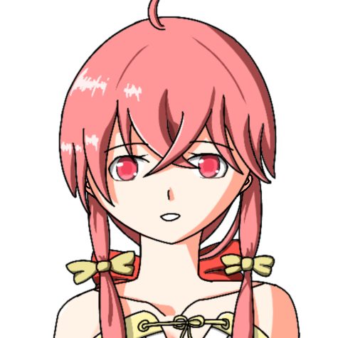

# Chara

Chara是一款基于JavaFX的桌面人物软件。

目前支持如下功能：

1. 随机动画：例如头发飘动、眨眼等
2. 点击人物的某些部位，人物给出对应的反馈
3. 眼睛跟随鼠标
4. 聊天功能：需要接入第三方chatbot
5. 互动好感度系统
6. 少量meta元素
7. 管理员指令
8. 模型文件封装
9. 插件功能

# 演示

## 眼睛跟踪鼠标

## 触摸反馈

触摸后的反应会根据羁绊值的高低而不同哦～

## 菜单交互

## 羁绊值

通过增加羁绊值和▇▇值解锁更多新交互吧～

...

减少羁绊值也会发生变化～

## 聊天交互

聊天交互需要事先配置chatbot

别点我

## R18特性

# 目前实现的角色

## 心璃

中文名：心璃  
英文名：Kokori  
日文名：心(ココ)璃(リ)  

设定：wkgcass  
[原画](https://www.pixiv.net/artworks/85094809)：wkgcass  
模型：wkgcass  
编码：wkgcass

一句话人物概述：神社的巫女，外表柔弱内心坚强的小姐姐，少量病娇属性。

# 开发文档

* [如何开发一个新角色](how-to-develop-a-new-character.md)
* [如何开发一个插件](how-to-develop-a-new-plugin.md)
